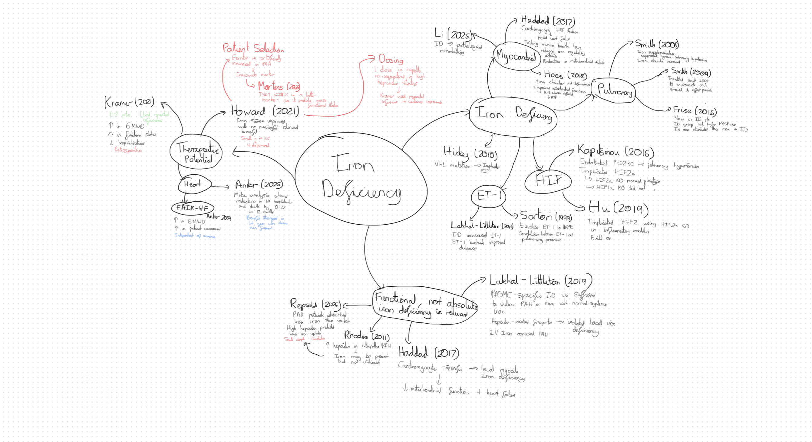

# Getting through third year: Sashank’s workflow

For incoming Oxford third-year medics. This is a practical workflow based on Sashank’s experience, the YEAR 3 Intro cards and his subsequent clarifications. It offers a way to organise the year; it does not promise a particular grade. The amount and quality of practice you put into it remain your choice.

## 1. Create breathing room early

The biggest priority is to finish the FHS research project early. Get approvals and supervisor arrangements moving immediately. Keep in regular contact with supervisors. If email is getting nowhere, try their office or arrange a conversation rather than allowing the project to stall.

Finishing coursework early gives you room for the viva, breaks and revision spread over more days. Aim to finish work ahead of the formal deadline, rather than spending the year working up to it.

| When | Target |
| --- | --- |
| Summer and start of Michaelmas | Move the research project forward; resolve approvals; choose your own five options using past-question predictability; begin Paper 3 practice. |
| During Michaelmas | Start Paper 3 methods, statistics and paper-analysis practice; arrange the extended-essay topic, adviser and registration in time for the current official deadline. |
| By November | Finish the project data analysis. |
| By the end of the calendar year | Have a near-final project draft. |
| Week 0 of Hilary | Have the project ready to submit. |
| Start of Hilary | Begin sustained extended-essay research and writing, building on the Michaelmas arrangements, and start chipping away at chemical pharmacology revision. |
| Hilary weeks 4–6 | Finish the extended essay and begin dedicated finals revision. |
| Through revision and the viva | Continue steady revision with protected breaks and fewer competing coursework deadlines. |

These are personal planning targets, not official submission dates. Check the course’s current requirements separately. Continue useful Paper 1 preparation and tutorial work throughout the year; the finals phase consolidates work already done.

## 2. Choose five options, then prepare four

Commit to five options of your own choosing at the beginning of the year. This guide does not recommend a default five. Cut down to four for exam preparation whenever you have enough information to decide.

Prioritise predictability. Read the past questions and identify the recurring question families before investing heavily in an option. Predictable questions give your preparation direction; highly variable questions make it harder to know what to prepare.

The option rankings are Sashank and friends’ assessments of predictability, not rankings of teaching quality, intellectual value or objective difficulty. The detailed historical rankings and workbook are in the local Year 3 source collection; they are not bundled in this skills repository. Review newer papers when using the historical rankings.

You do not need to choose options from three different fields just to prepare for Paper 2. A deliberately selected bank of versatile examples can provide breadth without studying several additional fields in full. The examples still need to fit the question you answer.

## 3. Make tutorials serve your preparation

Choose tutorial topics that recur in past questions. Spread tutorials sensibly so you have time to research, write and act on feedback. Ask for additional tutorials when you need them: tutors may arrange more, but you need to ask.

Use lectures as the beginning of your research. Build an argument of your own and find evidence beyond the lecture. Originality here means independent selection, synthesis and judgement; you do not need to invent a novel scientific finding.

## 4. Paper 1: evidence, argument, then memory

For each essay question or question family you plan to prepare:

1. Start with past questions and the lecture’s starting references. Use OpenEvidence or Research Rabbit to explore the literature if useful.
2. Gather roughly 50–60 relevant papers as an initial pool. This number is per prepared essay question, not per option. Overlapping questions can share papers.
3. Use ScholarGPT with the prompt **“Summarise and critique this paper”**. Check the original paper before relying on a finding or criticism in an essay.
4. Build a database tagged by option, topic and possible essay use. Give each paper a one-line statement of what it contributes.
5. Trim towards the 20–30 most useful papers. Versatility matters: prefer evidence you can use accurately in several arguments. Expect to use fewer papers in the actual exam answer.
6. Build your essay plan as a mind map organised around claims and relationships. Add supporting evidence, contrary evidence, limitations and potential explanations for disagreements.
7. Make cards from that map, then practise retrieving the evidence within an essay argument.

The numbers are working estimates, not quotas. Stop adding papers when you have enough evidence to build, challenge and refine the relevant arguments.

### Worked model: iron deficiency

The supplied mind map connects pulmonary and myocardial effects, HIF and ET-1 mechanisms, local versus systemic iron deficiency, and therapeutic potential. The therapeutic branch contrasts apparently conflicting studies and links the disagreement to patient selection, dosing and follow-up.

The live Iron Deficiency subdeck contains 40 notes. Its useful card types include:

- **Finding:** “What did Smith (2008) show?”
- **Method:** “What did Smith (2008) do?”
- **Strength:** “What is an advantage of Smith (2008)?”
- **Limitation:** “What is a limitation of Sartori (1999)?”
- **Comparison:** “What was the disparity between Haddad (2017) and Hoes (2018)?”
- **Specific criticism:** separate cards for Howard’s patient selection, dosing and follow-up.

This structure helps you recall both the evidence and what it can do in an argument. The source cards are study notes; their scientific claims have not all been independently checked for this draft.

### Essay practice

Aim for around **ten full essay plans, expressed as mind maps, across your four final options**. The supplied iron-deficiency mind map is an essay plan, not a separate preliminary task. These should offer flexibility across recurring question families. Adapt each plan to the wording in front of you.

Organise paragraphs around claims, with studies supporting or challenging those claims. Practise selecting evidence and explaining why it matters. Use tutorial feedback and the separate marking documents to judge the answer.

## 5. Paper 2: build a reusable example bank

Read the past questions first. Learn examples that can contribute to several themes, such as mechanism, translation, causal inference, reproducibility, technology and clinical endpoints. The local Year 3 collection contains a **Paper 2 examples** document drawn from Sashank’s Notion database. That example bank is not bundled here yet.

For each example, learn the core story, the argument it supports, the evidence you would cite and the limitation that prevents overclaiming. Pair examples where they help you show both sides of a debate. Practise choosing and adapting them to a fresh essay question.

Claude or ChatGPT can help suggest additional examples and connections. Treat those suggestions as leads to check, not as evidence by themselves.

## 6. Paper 3: practise the tasks

Start Paper 3 work in **Michaelmas**. Read the existing Paper 3 and statistics guides, then work through practice papers and marked examples alongside them. Spread this practice across the year. Practise recurring tasks such as identifying the most important figure, writing an abstract, evaluating strengths and limitations, and proposing follow-up experiments.

Learn answer structures, then ground each answer in the specific data and paper. Use the statistics deck to practise interpretation as well as definitions.

When a concept does not click, ask Claude or ChatGPT for a worked example with actual or simulated data. Ask it to generate an analysis in Python or R and explain the output. Your task is to understand how the output supports a conclusion, rather than to learn coding for its own sake. Try interpreting a new output before revealing the explanation.

The statistics course and related guides are available in Sashank’s local Year 3 folder, rather than in this repository. They are AI-assisted study documents, separate from official marking sources. A newer model may help improve explanations, but revisions should be checked against the original questions and answers.

## 7. Chemical pharmacology: focus revision

Sashank’s recommendation is to focus exam revision on the **Useful ChemPharm Deck (Past Paper Questions)**. Lectures are optional within his recommended study workflow. The lecture-based decks can consolidate understanding if you want them.

His experience was that the questions repeated sufficiently for the past-question deck to be his revision strategy. He estimates about **20 hours in total**. That is a personal estimate, not a guaranteed workload or mark. The current live version contains **248 notes producing 263 cards**, rather than exactly 200 cards.

## 8. Keep the year sustainable

Take breaks. Space tutorials so you can benefit from them. Ask for help and extra teaching when useful. Protect time for revision by completing coursework early, then work steadily rather than allowing every task to become urgent.

## Resources and status

This repository currently ships the Paper 1 marking skill. The complete teaching resources, past papers, Anki decks, examiner reports, example bank and historical predictability workbook remain in the local Year 3 collection. Students should use their own current course documents alongside these workflows.

The workflow incorporates the later corrections: no default five; four for finals; no prescribed three-field Paper 2 breadth; mind maps are essay plans; Paper 3 starts in Michaelmas. The 2026 extended-essay guidance required registration during Michaelmas, so Hilary writing should build on earlier topic/adviser arrangements. These administrative requirements should be checked for the student's own examination year.
